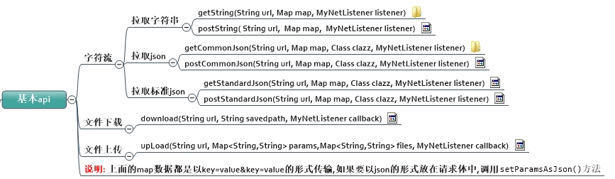
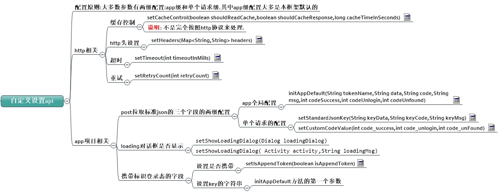

# HttpUtilForAndroid

面向接口,完全脱离具体的下层框架api

链式调用,傻瓜式使用

提供了okhttp和retrofit两个实现.

api设计上结合http协议和android平台特点来实现

[](https://jitpack.io/#hss01248/NetWrapper)


# update

[点击查看更新日志](https://github.com/hss01248/NetWrapper/blob/master/updatelog.md)

[老的api说明文档](/README_OLD.MD)


# 初始化配置

```
init(String baseUrl,Context context,boolean isDebug)
initAppDefault(String tokenName,String data,String code,String msg,int codeSuccess,int codeUnlogin,int codeUnfound)
```


# 几个入口方法

```
public  static <E> StringRequestBuilder<E> requestString(String url) 

public static <E> JsonRequestBuilder<E> requestJson(String url, Class clazz)

public static <E> StandardJsonRequestBuilder<E> reqeustStandardJson(String url, Class<E> clazz)

public static <E> DownloadBuilder<E> download(String url)

public static <E> UploadRequestBuilder<E> upload(String url, String fileDesc, String filePath)
```

# 通用配置

# http方法

```
getAsync(MyNetListener<T> listener)
postAsync(MyNetListener<T> listener)
```

# url

> 一般由上方httpUtil的初始化时设置以及入口方法传入.
>
> 如果入口方法中传入的url含有http或者https,则不会拼接初始化设置的baseUrl.

## http请求参数

### 两种设置形式

```
paramsStr(String paramsStr)//将一整个key=value形式或者json形式的字符串设置进来

addParams(String key,String value)//添加参数键值对
```

### 两种传输形式

> post请求时,在请求体中,可以key=value&key=value的形式传输,也可以json字符串的形式传输

```
setParamsAsJson()//默认为key=value的形式,调用此方法,改成以json形式传输
```


# http头

```
addHeader(String key,String value)
```

## 缓存控制

```
setCacheControl(boolean shouldReadCache,boolean shouldCacheResponse,long cacheTimeInSeconds)
```

## 1.下载

```
/**
 * 下载的一些通用策略:  downloadStratege

 * 1. 是否用url中的文件名作为最终的文件名,或者指定文件名
 * 2.如果是图片,音频,视频等多媒体文件,是否在下载完成后让mediacenter扫描一下?
 * 3. 如果是apk文件,是否在下载完成后打开?或者弹窗提示用户?
 * 4. md5校验 : 是否预先提供md5 ,下载完后与文件md5比较,以确定所下载的文件的完整性?
 * 5.断点续传的实现
 
 	6.下载队列和指定同时下载文件的个数
 * */
```


## 2.缓存

无网络时读缓存

缓存文件夹大小的设置

缓存功能改回由okhttp框架去实现,第一层控制请求头和响应头就好.


5.下载api有时也需要参数(如七牛的加参数的私有链接下载)

6.异步框架改写成Rxjava


# usage


## gradle

Step 1. Add the JitPack repository to your build file

Add it in your root build.gradle at the end of repositories:

```
allprojects {
    repositories {
        ...
        maven { url "https://jitpack.io" }
    }
}
```

Step 2. Add the dependency

```java
dependencies {
        compile 'com.github.hss01248:NetWrapper:1.0.1'
}
```


## api

```

```


## 概览


 


 

## json的解析: 

如果是jsonObject,

clazz传入实体类的Class,同时MyNetListener泛型设置为该实体类

如果JsonArray,:

clazz传入数组元素类的Class,同时MyNetListener泛型设置为该实体类,其回调采用

```
onSuccessArr(List<T> response,String resonseStr)
```


# 标准格式json的解析

## api:

getStandardJsonResonse

postStandardJsonResonse


## 请求的配置

### 默认字段和code码

```java
ConfigInfo:
public  static  String KEY_DATA = "data";
public static  String KEY_CODE = "code";
public static  String KEY_MSG = "msg";

BaseNetBean:
public static final int CODE_NONE = -1;
public static  int CODE_SUCCESS = 0;
public static  int CODE_UNLOGIN = 2;
public static  int CODE_UN_FOUND = 3;
```

### 全局配置

    MyNetApi:

```java
public static void init(Context context,String baseUrl,ILoginManager loginManager)
  
/**
     * 指定标准格式json的三个字段.比如聚合api的三个字段分别是error_code(但有的又是resultcode),reason,result,error_code
     * @param tokenName 
     * @param data
     * @param code
     * @param msg
     * @param codeSuccess
     * @param codeUnlogin
     * @param codeUnfound
     */
    public static void initAppDefault(String tokenName,String data,String code,String msg,int codeSuccess,int codeUnlogin,int codeUnfound)
```

### 单个请求的配置

    ConfigInfo:

```java
 public ConfigInfo<T> setStandardJsonKey(String keyData,String keyCode,String keyMsg)

 public ConfigInfo<T> setStandardJsonKeyCode(String keyCode)

 public ConfigInfo<T> setCustomCodeValue(int code_success,int code_unlogin,int code_unFound)
```


## 用本框架发起一个本app常规请求之外的标准json请求:


```
			/*	聚合api:笑话大全
					http://japi.juhe.cn/joke/content/list.from  get请求


                    sort	string	是	类型，desc:指定时间之前发布的，asc:指定时间之后发布的
                    page	int	否	当前页数,默认1
                    pagesize	int	否	每次返回条数,默认1,最大20
                    time	string	是	时间戳（10位），如：1418816972
                    key 	string  您申请的key
                    
                    返回:
                    {
                      "error_code": 0,
                       "reason": "Success",
                       "result": {....}
                     }
              */
                Map<String,String> map4 = new HashMap<>();
                map4.put("sort","desc");
                map4.put("page","1");
                map4.put("pagesize","4");
                map4.put("time",System.currentTimeMillis()/1000+"");
                map4.put("key","fuck you");


                MyNetApi.getStandardJson("http://japi.juhe.cn/joke/content/list.from",
                        map4, GetStandardJsonBean.class, new MyNetListener<GetStandardJsonBean>() {
                            @Override
                            public void onSuccess(GetStandardJsonBean response, String resonseStr) {
                                Logger.json(MyJson.toJsonStr(response));
                            }
                            @Override
                            public void onError(String error) {
                                super.onError(error);
                                Logger.e(error);
                            }
                        })
                        .setStandardJsonKey("result","error_code","reason")
                        .setCustomCodeValue(0,2,-1)
                        .setShowLoadingDialog(MainActivity.this,"加载中...")
                        .start();
```


# 完全的客户端缓存控制

> 已屏蔽下层网络执行层(okhttp)框架本身的缓存功能.

## 配置单个请求的缓存策略(默认是无缓存)

>只针对String和json的请求结果的缓存,缓存的形式是String,带有有效期.

```java
ConfigInfo:
 /**
 * 只支持String和json类型的请求,不支持文件下载的缓存.
 * @param shouldReadCache 是否先去读缓存
 * @param shouldCacheResponse 是否缓存response  内部已做判断,只会缓存状态是成功的那些请求
 * @param cacheTimeInSeconds 缓存的时间,单位是秒
 * @return
 */
public ConfigInfo<T> setCacheControl(boolean shouldReadCache,boolean shouldCacheResponse,long cacheTimeInSeconds)
```


## 


# blog

[基于retrofit的网络框架的终极封装(一):第一层参数组装层的API设计](http://gold.xitu.io/post/583e9c39ac502e006c365801)

[基于retrofit的网络框架的终极封装(二)-与retrofit的对接与解耦,以及遇到的坑](https://gold.xitu.io/post/5843b3e70ce463005778185c)

